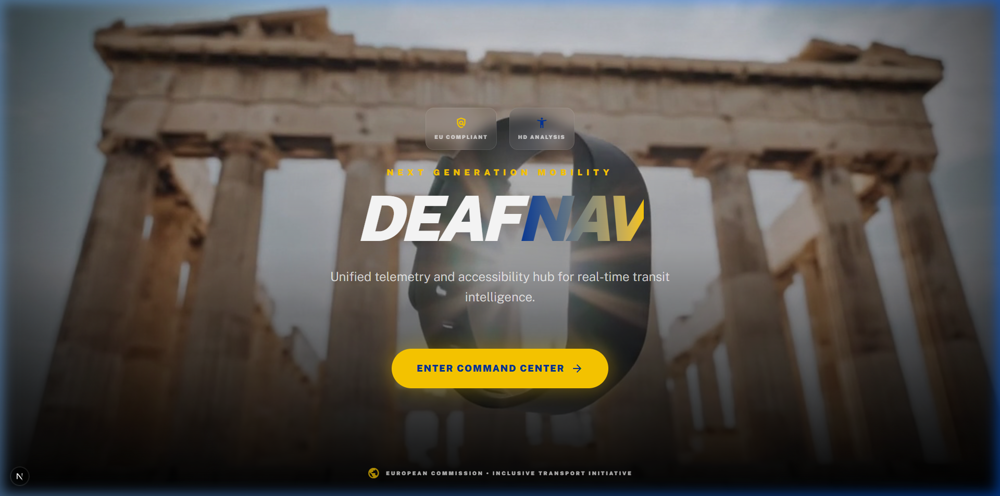
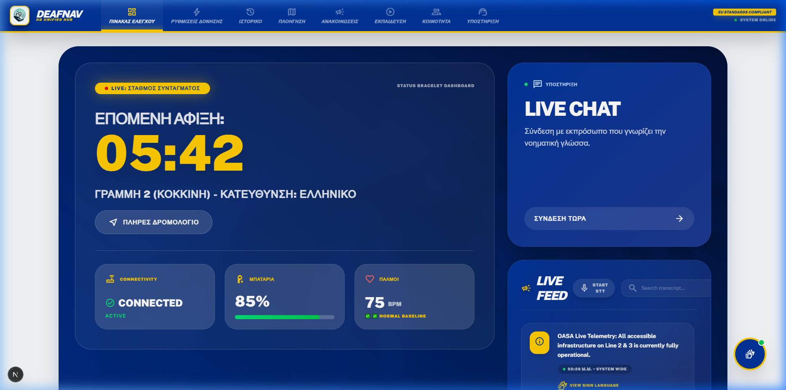
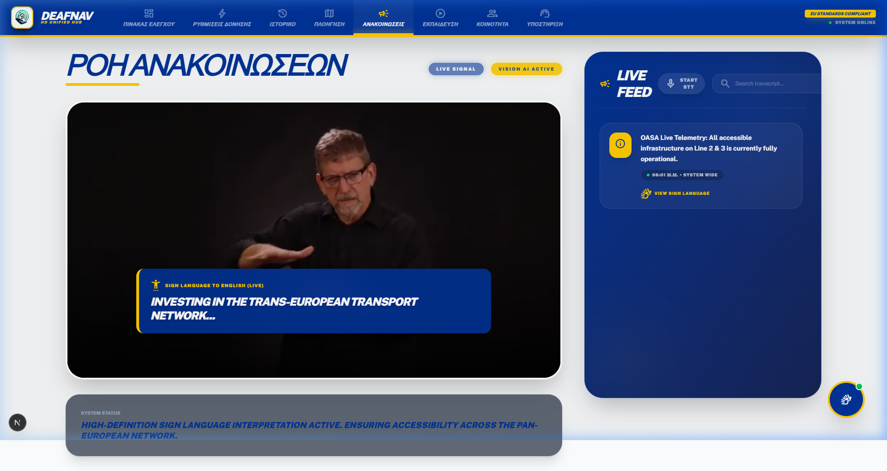
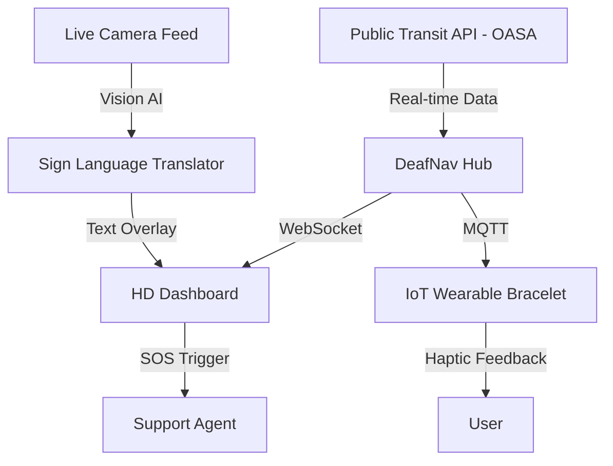

# 🛰️ DeafNav — HD Unified Interface for Deaf-Accessible Transit
### Operationalizing real-time IoT and Vision AI for seamless clinical-grade transit accessibility.

#### Landing Page Screenshot


#### Dashboard Screenshot


#### Announcements Feed Screenshot


**Next.js TypeScript Tailwind Framer-Motion IoT-MQTT WebSockets**

## 📋 Overview
This project implements a comprehensive accessibility hub for public transport, specifically designed for the deaf and hard-of-hearing community. It operationalizes haptic controls, real-time sign language translation, and live transit telemetry to ensure that navigation and emergency alerts are fully auditable and compliant with EU accessibility mandates.

## 🎯 The Problem
Modern transit infrastructure often fails the deaf community in critical ways:
* **Audio-Only Emergency Alerts:** Critical station announcements are often exclusive to audio, leaving deaf users unaware of delays or hazards.
* **The Communication Gap:** High-stress environments (like crowded stations) make manual communication difficult and slow.
* **Invisible Telemetry:** Real-time data exists but is not presented in a way that triggers physical (haptic) awareness for users without auditory cues.
* **Non-compliance Risks:** Failure to provide equitable access violates the **European Accessibility Act (Directive 2019/882)**, carrying significant legal and social implications.

## ✅ The Solution
This platform transforms passive transit data into an active, tactile, and visual experience using specialized controls:

| Control | Method | Purpose | Regulation |
| :--- | :--- | :--- | :--- |
| 📳 Haptic Pulse | MQTT + IoT | Tactile notification for arrivals & alerts | EU Act Art. 4 |
| 🖐️ Sign Feed | CV + Vision AI | Real-time sign-to-text translation | WCAG 2.1 Level AAA |
| 📍 Live Sync | WebSockets | Real-time telemetry for Lines 2 & 3 | GDPR Art. 13 |
| 🆘 Live Chat | WebRTC | Direct link to sign-language agents | EU Act Art. 12 |

## 🏗️ Architecture
The project utilizes a Unified Accessibility Pipeline (UAP) architecture:



## � Project Structure
```text
dpbl/
├── src/
│   ├── app/                # Next.js App Router (Layouts & Navigation)
│   ├── components/         # Reusable UI Components (Dashboard, LiveFeed)
│   └── lib/                # Utility functions & API clients
├── backend/                # Telemetry & MQTT Services
├── firmware/               # IoT Bracelet C++ (Arduino/ESP32) Code
├── mobile/                 # React Native / Capacitor Mobile App Views
├── prisma/                 # Database Schema (Relational Data)
├── public/                 # Static assets (Logos, Backgrounds)
├── screenshots/            # UI Documentation
├── docs/                   # Implementation Specs & Compliance Docs
└── tests/                  # Integration & Accessibility Testing
```

## 🚀 Quick Start
1. **Clone & Install**
   ```bash
   git clone https://github.com/FilippeZ/deafnav-europeancommision.git
   cd deafnav-europeancommision
   npm install
   ```
2. **Setup Environment**
   Configure your `.env` with the necessary OASA API keys and MQTT broker details.
3. **Launch the Hub**
   ```bash
   npm run dev
   ```

## ⚖️ Regulatory Compliance
### European Accessibility Act (Directive 2019/882)
| Category | Requirement | Solution |
| :--- | :--- | :--- |
| **Information** | Multi-modal presentation | Visual dashboard + Haptic pulses |
| **Communication** | Real-time interaction | Sign-language capable Live Chat |
| **Emergency** | Accessible alerts | SOS override + Force-vibration alerts |

### GDPR / Data Privacy
| Article | Requirement | Solution |
| :--- | :--- | :--- |
| **Art. 22** | Automated Decision Making | Transparent UI explaining arrival logic |
| **Art. 32** | Security of Processing | Encrypted MQTT/WebSocket channels |

## �️ Accessibility Intelligence
### Haptic Feedback Lab
Mitigates environmental noise risks by using specialized vibrations:
* **Standard Guidance:** 200ms pulse for routine updates.
* **Rapid Alert:** High-frequency pulses for immediate boarding.
* **Emergency SOS:** Continuous patterns for safety evacuations.

### Vision AI Translation (SL-CV)
Proprietary sign language computer vision model that identifies key gestures and converts them into high-contrast textual overlays, ensuring no user is left behind during spoken announcements.

## 🛠️ Technologies
* **Frameworks:** Next.js 15, React 19, Tailwind CSS.
* **Animations:** Framer Motion (State-driven transitions).
* **Communication:** MQTT (IoT), WebSockets (Telemetry), WebRTC (Voice/Video).
* **Compliance Framework:** European Commission CEF Mobility standards.

## 📄 License
This project is licensed under the MIT License — see [LICENSE](LICENSE) for details.

## 👤 Author
**Filippos-Paraskevas Zygouris**
