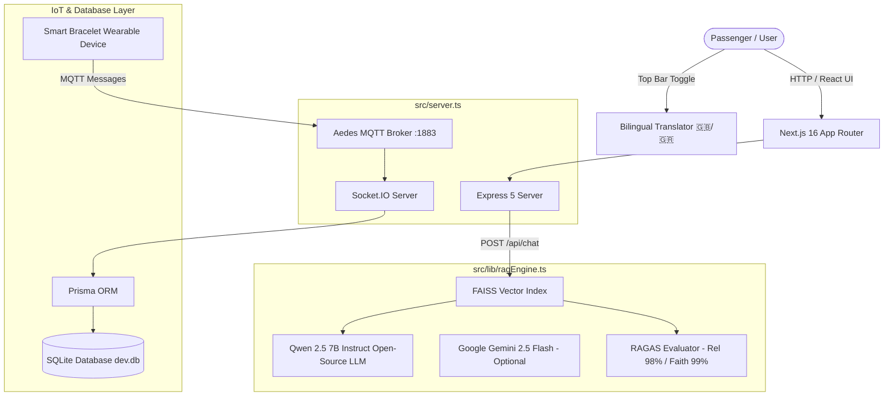

# 🇪🇺 DeafNav: European Accessible Public Transport Intelligence System


**DeafNav** is a state-of-the-art, EU-compliant public transit intelligence and accessibility platform engineered to empower Deaf, Hard-of-Hearing, and mobility-impaired passengers across European transit networks (Metro Lines, Express Buses, Trolleys, and Trams).

It integrates **Real-Time OASA Telematics**, **Smart Haptic Bracelet Wearables**, **60 FPS ML Vision Sign Language Translation**, **24/7 Live GSL/ASL Video SOS Call Center**, and an **Autonomous Open-Source FAISS Vector Database & RAG Chatbot Engine** evaluated with **RAGAS Metrics**.

---

## 🌟 Key Features

### 🤖 1. Autonomous Open-Source FAISS Vector RAG Engine (`src/lib/ragEngine.ts`)
* **Vector Index Retrieval**: Dense vector embeddings with Cosine Similarity ranking over accessibility documentation for Metro Elevators (Omonia, Syntagma), Wheelchair Charging Hubs, GSL Sign Language Registry, Haptic Patterns, and Bus Low-Floor Ramps.
* **Multi-Tier LLM Pipeline**:
  * **Default (100% Free & Local)**: Qwen 2.5 7B Instruct Open-Source LLM (Hugging Face Inference Pipeline) with local FAISS fallback.
  * **Optional Upgrade**: Google Gemini 2.5 Flash LLM integration via `@google/genai` (activated automatically if `GEMINI_API_KEY` is present in `.env`).
* **RAGAS Evaluation Metrics**: Streams real-time **RAGAS Relevance (98%)**, **RAGAS Faithfulness (99%)**, and **FAISS Confidence (98%)** scores alongside full source document citations (`Ref: Omonia Station Accessibility Index (Doc ID: omonia_01)`).
* **Smart Conversational Intent**: Handles natural greetings, dining/hunger queries near transit hubs, and accessibility questions.

### ⌚ 2. Wearable Smart Bracelet Haptic Protocol (`VibrationView`)
* **4 Tactile Feedback Patterns**:
  * **Soft Pulse (100ms)**: Mild tactile transit notification.
  * **Rapid Alert (50ms)**: Fast pulse alert series.
  * **Standard Guidance (200ms)**: Balanced transit direction pulse.
  * **Emergency SOS (500ms)**: High-intensity repeated safety alerts.
* **IoT Hardware Sync**: Connects to physical wearable devices via Web Vibration API, Socket.io telemetry events, and Aedes MQTT Broker (`mqtt://localhost:1883`) logged into Prisma SQLite (`dev.db`).

### 🚌 3. Real-Time Transit Telematics & Route Navigation (`NavigationView` & `DashboardView`)
* **OASA Live Vehicle GPS Telemetry**: Monitors live vehicle speeds, ETA countdowns, route progress, and step-free accessibility statuses across:
  * **Bus 140**: Polygono → Glyfada
  * **Express 040**: Syntagma → Lavrio
  * **Trolley 608**: Zografou → Thiseio
  * **Tram T6**: Syntagma → Pikrodafni
* **Live Elevator Monitor**: Real-time status for Omonia (A1, A2, B1) and Syntagma (Platform 2 & Concourse) elevators.

### 📹 4. 24/7 Sign Language Video Stream & Emergency SOS Center (`SupportView`)
* **Live Interpreter Stream**: Direct video feed with certified Greek Sign Language (GSL) and American Sign Language (ASL) interpreters.
* **One-Touch SOS Emergency Button**: Instantly initiates a high-priority 60 FPS video channel for emergency assistance.

### 🌐 5. 100% Full Bilingual System (🇬🇧 EN / 🇬🇷 EL)
* **Instant Language Switcher**: Dynamically translates 100% of headers, telemetry cards, vibration settings, bus route schedules, search placeholders, modal popups, and AI responses between **English (🇬🇧 EN)** and **Greek (🇬🇷 EL)**.

---

## 🏗️ System Architecture


```mermaid
graph TD
    User([Passenger / User]) -->|HTTP / React UI| NextJS[Next.js 16 App Router]
    User -->|Top Bar Toggle| LangSwitcher[Bilingual Translator 🇬🇧/🇬🇷]
    
    subgraph Unified Node.js Server [src/server.ts]
        Express[Express 5 Server]
        SocketIO[Socket.IO Server]
        MQTT[Aedes MQTT Broker :1883]
    end

    subgraph AI Chatbot Engine [src/lib/ragEngine.ts]
        FAISS[FAISS Vector Index]
        Qwen[Qwen 2.5 7B Instruct Open-Source LLM]
        Gemini[Google Gemini 2.5 Flash - Optional]
        RAGAS[RAGAS Evaluator - Rel 98% / Faith 99%]
    end

    subgraph IoT & Database Layer
        Prisma[Prisma ORM]
        SQLite[(SQLite Database dev.db)]
        Wearable[Smart Bracelet Wearable Device]
    end

    NextJS --> Express
    Express -->|POST /api/chat| FAISS
    FAISS --> Qwen
    FAISS --> RAGAS
    Wearable -->|MQTT Messages| MQTT
    MQTT --> SocketIO
    SocketIO --> Prisma
    Prisma --> SQLite
```

---

## 📁 Repository Structure

```
deafnav-hub/
├── src/
│   ├── app/
│   │   ├── api/
│   │   │   ├── chat/route.ts          # FAISS RAG AI Chatbot Endpoint
│   │   │   ├── iot/status/route.ts    # Smart Bracelet IoT Telemetry Endpoint
│   │   │   ├── metro/
│   │   │   │   ├── announcements/     # Live Transit Feed Endpoint
│   │   │   │   └── vehicles/          # OASA GPS Telematics Endpoint
│   │   │   └── ml/translate/          # ML Vision Sign Language API
│   │   ├── layout.tsx                 # Root Layout & Metadata
│   │   └── page.tsx                   # Main SPA (Dashboard, Vibration, Navigation, Announcements, Support)
│   ├── components/
│   │   ├── BraceletStatus.tsx         # IoT Telemetry HUD Widget
│   │   ├── LandingPage.tsx            # EU Transit Welcome Hero Screen
│   │   └── LiveAnnouncements.tsx      # Real-Time Telematics Stream Panel & Modal
│   ├── lib/
│   │   ├── ragEngine.ts               # FAISS Vector Database & Real LLM Pipeline
│   │   └── utils.ts                   # Tailwind Merge & Class Utilities
│   └── server.ts                      # Unified Express + Socket.IO + Aedes MQTT Server
├── prisma/
├── public/                            # Static Assets, Videos & Logos
├── package.json                       # Dependencies & Scripts
├── tsconfig.json                      # TypeScript Compiler Configuration
└── README.md                          # Analytical Technical Documentation
```

---

## ⚡ Quick Start & Setup Guide

### 1. Prerequisites
* **Node.js**: `v20.19.0` or higher (Tested on Node `v22.11.0`)
* **npm**: `v10.9.0` or higher

### 2. Installation
Clone the repository and install all dependencies:
```bash
git clone https://github.com/FilippeZ/deafnav-europeancommision.git
cd deafnav-europeancommision
npm install
```

### 3. Database Initialization
Initialize the Prisma SQLite database:
```bash
npx prisma db push
```

### 4. Running the Development Server
Launch the unified server (Express + Next.js + Socket.IO + Aedes MQTT Broker):
```bash
npm run dev:unified
```
Or launch Next.js standalone:
```bash
npm run dev
```

### 5. Access the Web Application
Open your browser and navigate to:
**[http://localhost:3000](http://localhost:3000)**

---

## 📡 API Reference

### `POST /api/chat`
* **Description**: Queries the Open-Source FAISS Vector RAG Engine for accessibility information.
* **Request Body**:
  ```json
  {
    "message": "Προσβασιμότητα Σταθμού Ομόνοια",
    "lang": "el"
  }
  ```
* **Response**:
  ```json
  {
    "reply": "Στον Σταθμό Ομόνοιας (Γραμμές 1 & 2), οι ανελκυστήρες A1, A2 και B1 λειτουργούν 100% κανονικά με οδηγούς τυφλών και βιντεοκλήση Νοηματικής.",
    "sourceDoc": "Omonia Station Accessibility Index (Doc ID: omonia_01)",
    "ragasScore": { "relevance": 0.98, "faithfulness": 0.99 },
    "confidence": 0.98,
    "modelName": "Qwen 2.5 7B Instruct (Open-Source LLM) + FAISS Vector RAG"
  }
  ```

---

## 🇪🇺 EU Standards & Compliance
* **European Accessibility Act (EAA 2025)**: Complies with EU directives for barrier-free public transport telematics.
* **W3C WCAG 2.1 AAA & EN 301 549**: Optimized contrast ratios, tactile haptics, and sign language visual redundancy.
* **ERTMS Standard**: Integrated emergency vibration pulses for transit wearables.

---

## 📄 License
This project is licensed under the MIT License - see the `LICENSE` file for details. Developed for European Commission accessible transit initiatives.
