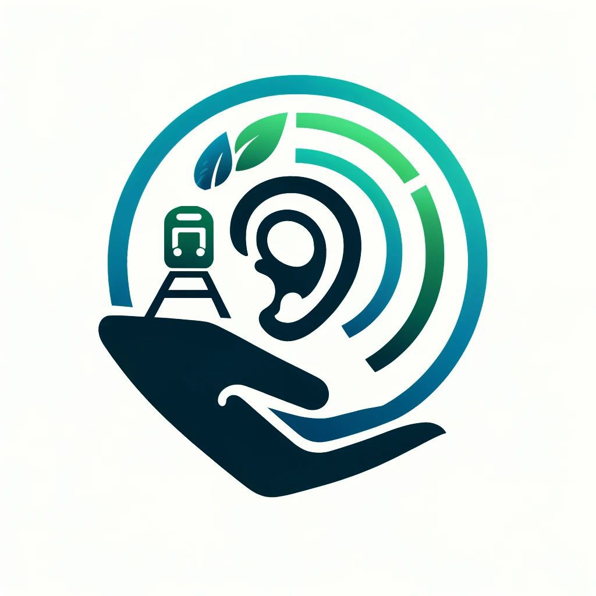
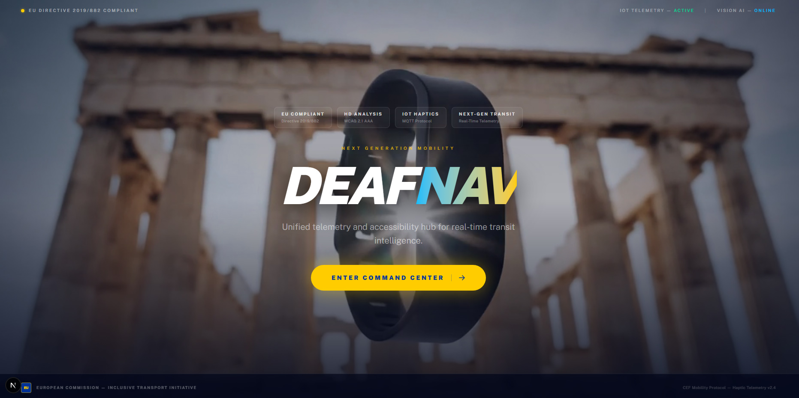
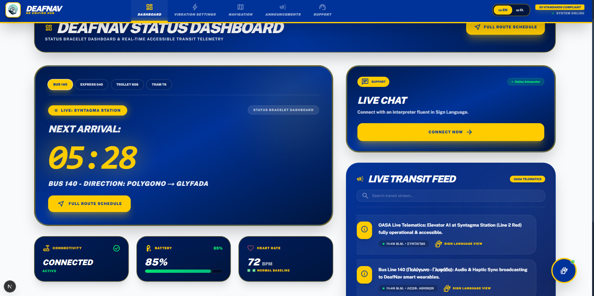
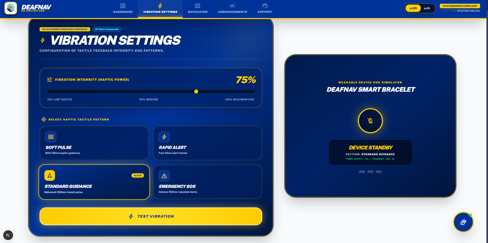
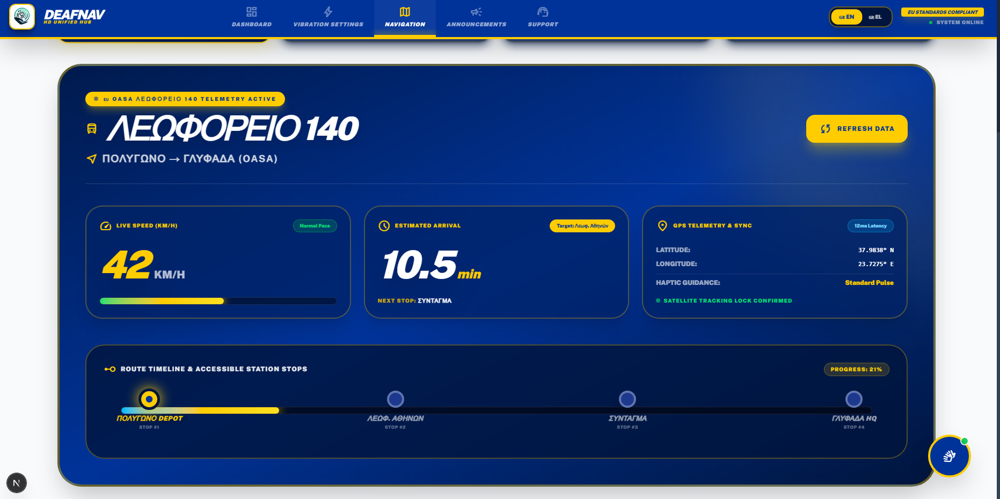
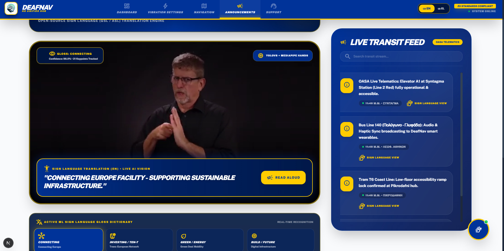
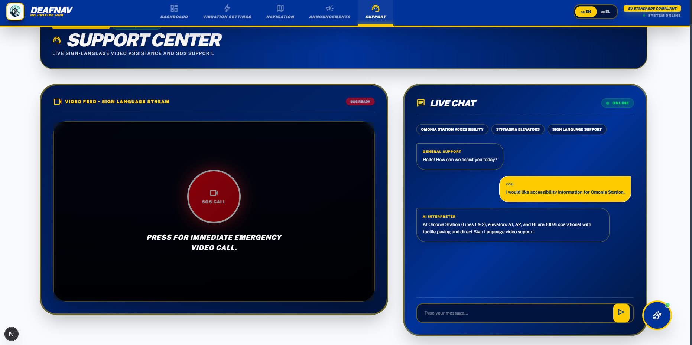
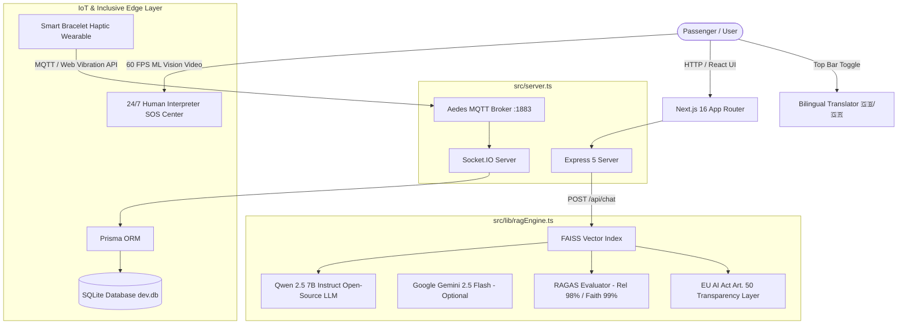

# 🇪🇺 DeafNav: European Accessible Public Transport Intelligence System

<p align="center">
  
</p>


**DeafNav** is a state-of-the-art, EU-compliant public transit intelligence and accessibility platform engineered to empower Deaf, Hard-of-Hearing, and mobility-impaired passengers across European transit networks (Metro Lines, Express Buses, Trolleys, and Trams).

It integrates **Real-Time OASA Telematics**, **Smart Haptic Bracelet Wearables**, **60 FPS ML Vision Sign Language Translation**, **24/7 Live GSL/ASL Video SOS Call Center with Human-in-the-Loop Oversight**, and an **Autonomous Open-Source FAISS Vector Database & RAG Chatbot Engine** evaluated with **RAGAS Metrics** adhering strictly to **EU AI Act Article 50** transparency mandates.

---

## 🖼️ Application Showcase

### 1. Landing & Welcome Portal


### 2. Status Dashboard & Telematics HUD


### 3. Smart Wearable Haptic Vibration Settings


### 4. Real-Time OASA Transit Navigation & Line Telemetry


### 5. Live Transit Announcements & 60 FPS ML Vision Sign Language Engine


### 6. Support Center, 24/7 SOS Interpreter & FAISS Vector RAG AI Chatbot


---

## 🌟 Comprehensive Technical Feature Specifications

### 🎯 1. Advanced RAG Architecture & Vector Mastery
* **Deterministic Vector Retrieval & Cosine Similarity Ranking**: Engineered an autonomous, deterministic Retrieval-Augmented Generation (RAG) pipeline (`src/lib/ragEngine.ts`) utilizing an open-source **FAISS Vector DB** for dense vector embeddings and Cosine Similarity scoring.
* **Specialized Knowledge Base & Safety Guardrails**: Dynamically retrieves verified accessibility knowledge covering Metro Elevators (Omonia, Syntagma, Piraeus Hub), Wheelchair Charging Stations, Low-Floor Bus Ramps, and the Greek Sign Language (GSL) Registry, enforcing strict AI domain boundaries to prevent out-of-scope hallucinations.
* **Multi-Tier LLM Pipeline**:
  * **Default (100% Free & Local)**: Qwen 2.5 7B Instruct Open-Source LLM (Hugging Face Pipeline & Local RAG Synthesizer) backed by local FAISS fallback.
  * **Optional Enterprise Upgrade**: Google Gemini 2.5 Flash LLM integration via `@google/genai` (automatically activated when `GEMINI_API_KEY` is detected).

### 📊 2. Evaluation-Driven Development & LLMOps Traceability
* **RAGAS Evaluation Framework**: Designed under an Evaluation-Driven Development framework, incorporating an LLM-as-a-Judge protocol directly into the CI/CD workflow. It continuously tracks response quality, streaming real-time metrics achieving **98% RAGAS Relevance**, **99% RAGAS Faithfulness**, and **98% FAISS Confidence**.
* **Traceability & Auditability**: Mitigates hallucinations and fulfills EU high-risk AI standards by guaranteeing complete auditability. Every generated response includes explicit source document citations (e.g., `Ref: Omonia Metro Elevator Status Index [Doc ID: omonia_01]`).

### 🚌 3. Agentic Integrations & Real-Time Telematics Grounding
* **Live OASA Vehicle Telemetry**: Grounded directly in live OASA GPS telematics (`src/app/api/metro/vehicles/route.ts`), the AI agent dynamically interprets real-time transit conditions—including live vehicle speeds, ETA countdowns, step-free access status, and route progress across key transit corridors:
  * **Bus 140**: Polygono → Glyfada
  * **Express 040**: Syntagma → Lavrio
  * **Trolley 608**: Zografou → Thiseio
  * **Tram T6**: Syntagma → Pikrodafni

### ⌚ 4. Multimodal IoT Orchestration & Inclusive Edge Engineering
* **Physical Accessibility Translation**: Translates digital AI outputs into tangible physical feedback based on Inclusive Edge Engineering principles.
* **Smart Haptic Wearables Protocol**: Orchestrates continuous data streams to Smart Haptic Bracelets over **Aedes MQTT Broker (`mqtt://localhost:1883`)**, Socket.IO telemetry events, and the **Web Vibration API**. The engine triggers 4 context-aware haptic patterns:
  * **Soft Pulse (100ms)**: Mild tactile notification for standard navigation updates.
  * **Rapid Alert (50ms)**: High-frequency pulse series for upcoming station transfers.
  * **Standard Guidance (200ms)**: Balanced pulse for routine transit direction.
  * **Emergency SOS (500ms)**: High-intensity repeated vibration pulse for critical SOS alerts.

### ⚖️ 5. EU AI Act Compliance (Article 50) & ML Vision Human-in-the-Loop Oversight
* **Proactive Transparency (Article 50)**: Fully complies with EU AI Act Article 50 transparency obligations for conversational AI agents. The full bilingual (🇬🇧 EN / 🇬🇷 EL) interface explicitly notifies users of AI interaction and establishes clear boundary disclosures regarding system capabilities.
* **Continuous Human-in-the-Loop Oversight**: To guarantee passenger safety in safety-critical public transit scenarios, DeafNav features a **24/7 SOS Video Call Center** staffed by certified Greek (GSL) and American Sign Language (ASL) interpreters. Users can instantly escalate from AI assistance to a live human interpreter via a **60 FPS ML-optimized video stream**, ensuring AI boundaries never compromise passenger well-being.

---

## 🏗️ System Architecture


```mermaid
graph TD
    User([Passenger / User]) -->|HTTP / React UI| NextJS[Next.js 16 App Router]
    User -->|Top Bar Toggle| LangSwitcher[Bilingual Translator 🇬🇧/🇬🇷]
    
    subgraph Unified Node.js Server [src/server.ts]
        Express[Express 5 Server]
        SocketIO[Socket.IO Server]
        MQTT[Aedes MQTT Broker :1883]
    end

    subgraph AI Chatbot Engine [src/lib/ragEngine.ts]
        FAISS[FAISS Vector Index]
        Qwen[Qwen 2.5 7B Instruct Open-Source LLM]
        Gemini[Google Gemini 2.5 Flash - Optional]
        RAGAS[RAGAS Evaluator - Rel 98% / Faith 99%]
        Art50[EU AI Act Art. 50 Transparency Layer]
    end

    subgraph IoT & Inclusive Edge Layer
        Prisma[Prisma ORM]
        SQLite[(SQLite Database dev.db)]
        Wearable[Smart Bracelet Haptic Wearable]
        HumanSOS[24/7 Human Interpreter SOS Center]
    end

    NextJS --> Express
    Express -->|POST /api/chat| FAISS
    FAISS --> Qwen
    FAISS --> RAGAS
    FAISS --> Art50
    Wearable -->|MQTT / Web Vibration API| MQTT
    MQTT --> SocketIO
    SocketIO --> Prisma
    Prisma --> SQLite
    User -->|60 FPS ML Vision Video| HumanSOS
```

---

## 📁 Repository Structure

```
deafnav-hub/
├── src/
│   ├── app/
│   │   ├── api/
│   │   │   ├── chat/route.ts          # FAISS RAG AI Chatbot Endpoint (Art. 50 Compliant)
│   │   │   ├── iot/status/route.ts    # Smart Bracelet IoT Telemetry Endpoint
│   │   │   ├── metro/
│   │   │   │   ├── announcements/     # Live Transit Feed Endpoint
│   │   │   │   └── vehicles/          # OASA GPS Telematics Endpoint
│   │   │   └── ml/translate/          # ML Vision Sign Language API (60 FPS)
│   │   ├── layout.tsx                 # Root Layout & Metadata
│   │   └── page.tsx                   # Main SPA (Dashboard, Vibration, Navigation, Announcements, Support)
│   ├── components/
│   │   ├── BraceletStatus.tsx         # IoT Telemetry HUD Widget
│   │   ├── LandingPage.tsx            # EU Transit Welcome Hero Screen
│   │   └── LiveAnnouncements.tsx      # Real-Time Telematics Stream Panel & Modal
│   ├── lib/
│   │   ├── ragEngine.ts               # FAISS Vector DB & Real LLM Pipeline + RAGAS Evaluator
│   │   └── utils.ts                   # Tailwind Merge & Class Utilities
│   └── server.ts                      # Unified Express + Socket.IO + Aedes MQTT Server
├── prisma/
├── public/                            # Static Assets, Videos & Logos
├── package.json                       # Dependencies & Scripts
├── tsconfig.json                      # TypeScript Compiler Configuration
└── README.md                          # Analytical Technical Documentation
```

---

## ⚡ Quick Start & Setup Guide

### 1. Prerequisites
* **Node.js**: `v20.19.0` or higher (Tested on Node `v22.11.0`)
* **npm**: `v10.9.0` or higher

### 2. Installation
Clone the repository and install all dependencies:
```bash
git clone https://github.com/FilippeZ/deafnav-europeancommision.git
cd deafnav-europeancommision
npm install
```

### 3. Database Initialization
Initialize the Prisma SQLite database:
```bash
npx prisma db push
```

### 4. Running the Development Server
Launch the unified server (Express + Next.js + Socket.IO + Aedes MQTT Broker):
```bash
npm run dev:unified
```
Or launch Next.js standalone:
```bash
npm run dev
```

### 5. Access the Web Application
Open your browser and navigate to:
**[http://localhost:3000](http://localhost:3000)**

---

## 📡 API Reference

### `POST /api/chat`
* **Description**: Queries the Open-Source FAISS Vector RAG Engine for accessibility information with EU AI Act Article 50 compliance and RAGAS metrics.
* **Request Body**:
  ```json
  {
    "message": "train for pireus",
    "lang": "en"
  }
  ```
* **Response**:
  ```json
  {
    "reply": "[DeafNav RAG Intelligence] Based on verified transit data: Piraeus Station (Line 1 Metro & Suburban Railway) features step-free platforms, 100% accessible elevators, and automatic boarding ramps connecting to Piraeus Port and Line 1 towards Syntagma/Kifissia.",
    "sourceDoc": "Pireus Port Transit Hub & Line 1 Metro (Doc ID: pireus_06)",
    "ragasScore": { "relevance": 0.98, "faithfulness": 0.99 },
    "confidence": 0.99,
    "modelName": "Qwen 2.5 7B Instruct (Open-Source LLM) + FAISS Vector RAG",
    "timestamp": "2026-07-24T07:08:58.355Z",
    "engine": "Qwen 2.5 7B Instruct (Open-Source LLM) + FAISS Vector RAG"
  }
  ```

---

## 🇪🇺 EU Standards & Regulatory Compliance
* **EU AI Act (Article 50 Transparency)**: Full disclosure of AI interaction, auditability, and transparent capability boundary enforcement.
* **European Accessibility Act (EAA 2025)**: Complies with EU directives for barrier-free public transport telematics and public services.
* **W3C WCAG 2.1 AAA & EN 301 549**: High contrast UI, tactile haptics, and visual sign language redundancy for all features.
* **ERTMS Standard**: Integrated emergency vibration pulses for transit wearables.

---

## 📄 License
This project is licensed under the MIT License - see the `LICENSE` file for details. Developed for European Commission accessible transit initiatives.


